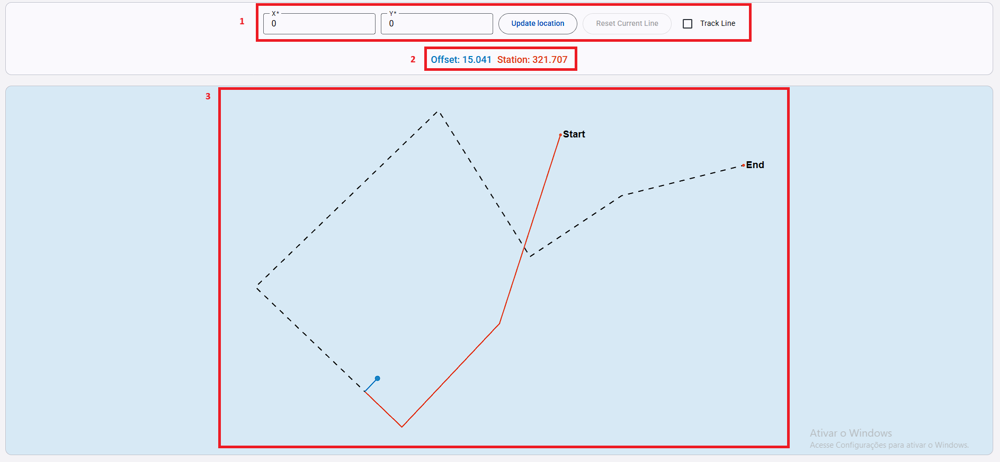
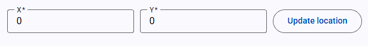
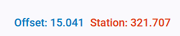
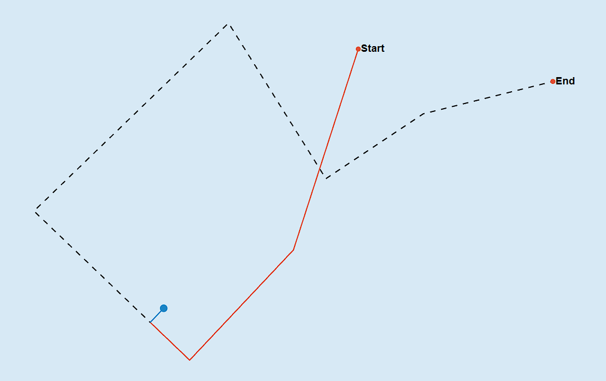
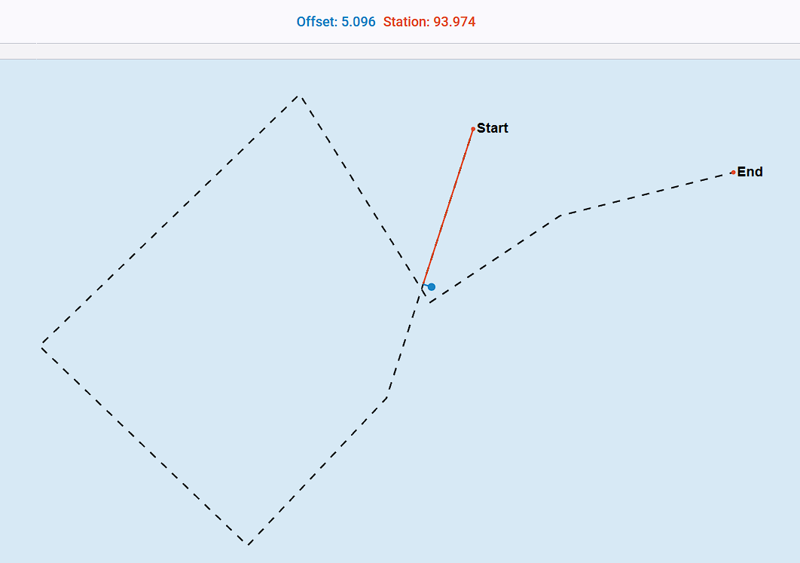
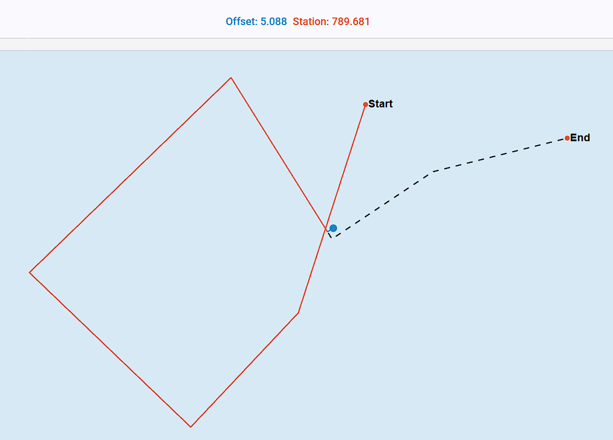
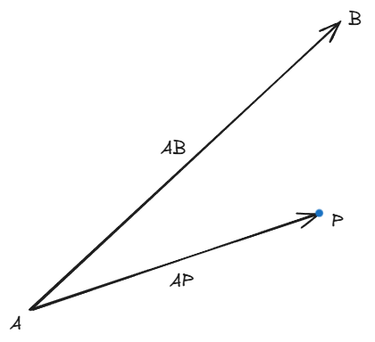
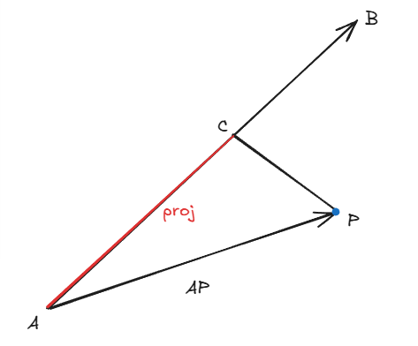

## Demo
A demo is available temporarily at https://chatter-api.space/

## Frontend
1. **Path visualization**:
The path defined in the CSV file is rendered as a polyline, allowing the user to visually understand the tracked route.

2. **User input**:
The user can input X and Y coordinates and trigger a calculation request to the backend.

3. **Result rendering**:
The backend responds with the calculated offset and station values for the given point.
These results are visually represented in the UI, including the offset line and the corresponding station along the path.

#### Overall layout


#### 1. Inputs


Two text inputs, implemented using Angular Material, are provided for the X and Y coordinates.
Both inputs include validation to ensure that only numeric values are accepted, preventing invalid requests from being sent to the backend.

Validation feedback is displayed directly in the UI, improving usability and guiding the user to provide correct input.

To send the request the user can click the Update location button or press enter while on the X or Y input.

#### 2. Indicators


The indicators display the Offset and Station values calculated by the backend.
Each indicator uses the same color as its corresponding graphical element in the graph, creating a clear visual association between numeric values and their geometric representation.

This design helps the user quickly understand how the calculated values relate to the rendered path and position.

### 3. Graph


The graph contains the following:
- Polyline path: generated from the coordinates in the input CSV file, displayed as a black dashed line.
- Path endpoints: start and end markers, represented by red points with corresponding labels.
- User input point: the coordinate provided by the user, displayed as a blue point.
- Offset line: the perpendicular line connecting the user point to the closest point on the path, displayed in blue.
- Station line: the segment representing the station position along the path, displayed in red.

All visual information is rendered using a graph built purely with SVG.
This approach was chosen to provide greater flexibility and high performance, while avoiding the overhead and limitations of external charting libraries.

Using SVG allows:
- Precise control over geometric elements (polyline, offset line, station)
- Efficient rendering, even with frequent updates
- A lightweight solution with no additional dependencies

### Responsiveness

The frontend application is fully responsive and designed to adapt seamlessly to different screen sizes and devices.
It provides a consistent and accessible user experience across desktops, tablets, and mobile devices, ensuring usability regardless of platform or resolution.

### Limitations & Future Improvements
TODO

## Backend
1. **Receive User inputs**: The backend receives the X and Y coordinates provided by the frontend via a REST API request.

2. **Parse input data**:
The path coordinates are read from the CSV file and mapped into a strongly typed data structure, ensuring consistency and type safety.

3. **Build line segments from coordinates**:
Consecutive coordinates are paired to form a collection of line segments representing the polyline path.

4. **Evaluate each line segment**:
For each line segment, the algorithm
- Calculates the station and offset relative to the user-provided point
- Compares the computed offset against previously evaluated segments
- Identifies the segment with the smallest offset value, representing the closest segment to the point

5. **Send the response**: The calculated offset, station, and other relevant information are returned to the frontend as a structured API response.

### The cross paths problem
During the initial implementation, a potential issue was identified:
when a position lies exactly over the intersection of two segments—or is slightly closer to a future segment that has not yet been traversed—the algorithm may report an incorrect station or segment index.

For example here when the position is x=126 and y=109:


If we move the y one unit to y=108 we will get:


To address this, a second approach was introduced: line tracking.

In this mode, the client sends the current line index to the backend. Instead of evaluating the entire path, the backend compares the position only against the current line and the next line. If the offset to the next line becomes smaller than the offset to the current line, progression occurs and the next line becomes the new current line—similar to a checkpoint mechanism.

The current line index is stored on the client side (local storage) and updated with each response. This strategy ensures consistent forward progression along the path and prevents incorrect jumps caused by intersecting or closely spaced segments.

### Project Architecture
The project is consists of 3 main layers:
- Controller
- Service (business logic layer)
- Repository (data access layer)

#### Controller
The class [TrackerController](./tracker-backend/TrackerApi/Controllers/TrackerController.cs) consists of the mapping of two endpoints:
- **GET `/api/status`**: Returns the current tracking status based on the provided coordinates.  
  **Query parameters:**
  - **x** *(float, required)* — X coordinate of the input point
  - **y** *(float, required)* — Y coordinate of the input point
  - **trackLine** *(boolean, optional)* — Enables line tracking logic (default: `false`)
  - **currentLineIndex** *(integer, optional)* — Index of the current line segment when line tracking is enabled (default: `0`)


Example Requests

Get tracking status (without line tracking):
```
GET /api/status?x=12.5&y=-3.8
```

Get tracking status with line tracking enabled:
```
GET /api/status?x=12.5&y=-3.8&trackLine=true&currentLineIndex=4
```
Example Response
```
{
  "offset": 2.37,
  "station": 15.8,
  "closestPoint": {
    "x": 12.1,
    "y": -4.0
  },
  "currentLineIndex": 0
}
```

- **GET /api/path**: Returns the full set of path coordinates provided by the csv file. Does not require any parameter.

Example Response:
```
[
  { "x": 0, "y": 0 },
  { "x": 50, "y": 20 },
  { "x": 100, "y": 40 },
  { "x": 150, "y": 70 }
]
```

#### Service
The class [TrackerService.cs](./tracker-backend/TrackerApi/Services/TrackerService.cs) is responsible for the core tracking logic of the application.
It loads the configured path coordinates and calculates the tracking status of a given point relative to that path, including:
- The closest point on the path
- The offset (Euclidean distance to the path)
- The station, representing the distance along the path
- The current line segment index

The service supports two methods:
- GetStatus: Standard tracking, which evaluates the entire path to find the closest segment.
- GetStatusWithLineTrack: Line tracking, which optimizes the calculation by comparing only the current and next segments.

Path data is retrieved via a repository abstraction, ensuring separation of concerns and testability.
#### Repository
The [PathRepository](./tracker-backend/TrackerApi/Repositories/PathRepository.cs) is responsible for loading path data from a CSV file stored on the server.

It reads the configured file from the application’s data directory, parses each line into coordinates, and returns the result as a collection of CoordinateDTO objects.
The repository handles file access and parsing concerns, keeping data retrieval logic isolated from business rules.

### Offset Calculation
In order to calculate the value of the offset between a line and a given point, a vectorial approach was taken. 
Considering the following points:
- A: Start of the line segment.
- B: End of the line segment.
- P: The external point provided by the user.
The offset is defined as the shortest distance between point P and the line segment AB.

#### Closest Point Calculation

The first step is to compute the point C, which represents the closest point on the line segment AB to the external point P.

1. Construct the vectors:


- AB = B − A
- AP = P − A


2. Project vector AP onto AB using the dot product:



The normalized projection is given by $t_{\text{normalized}} = \frac{\mathbf{AP} \cdot \mathbf{AB}}{\lVert \mathbf{AB} \rVert^{2}}$.

3. Clamp the projection factor t to the interval [0 1] to ensure that the resulting point lies within the line segment rather than on the infinite line.

4. Compute the closest point:

$$
\mathbf{C} = \mathbf{A} + t_{\text{normalized}} \, \mathbf{AB}
$$

**Offset Value**

Once the closest point C is determined, the offset is calculated as the Euclidean distance between P and C:

$$
\text{offset} = \lVert \mathbf{P} - \mathbf{C} \rVert
$$

This value represents the perpendicular distance from the input point to the nearest line segment and is used to determine which segment of the polyline is closest to the user-provided coordinate.

### Station Calculation
The station value represents the accumulated distance along the polyline from its starting point up to the position closest to the user-provided coordinate.


It is calculated as the sum of:
- The lengths of all line segments preceding the closest segment, and
- The distance from the start of the closest line segment to the computed closest point on that segment.

### Validation
The API validates coordinate inputs using Data Annotations to ensure all requests contain valid and usable numeric values.

Each coordinate is represented by the [CoordinateDTO](./tracker-backend/TrackerApi/DTOs/CoordinateDTO.cs) object:

- X and Y are required fields
- Both values must be valid floating-point numbers
- Requests with missing or invalid values are automatically rejected with a 400 Bad Request

**Sample Error Response**

When validation fails, the API returns a 400 Bad Request with a detailed error payload:
```
{
  "type": "https://tools.ietf.org/html/rfc7231#section-6.5.1",
  "title": "One or more validation errors occurred.",
  "status": 400,
  "errors": {
    "X": [
      "X is required."
    ]
  }
}
```

If multiple fields are invalid, all errors are returned in the same response:
```
{
  "type": "https://tools.ietf.org/html/rfc7231#section-6.5.1",
  "title": "One or more validation errors occurred.",
  "status": 400,
  "errors": {
    "X": [
      "X is required."
    ],
    "Y": [
      "Y is required."
    ]
  }
}
```

This approach provides clear feedback to API consumers and helps ensure data integrity across all requests.


### Tests
All application classes are covered by unit tests, which are implemented in a separate project [TrackerApi.Tests](/tracker-backend/TrackerApi.Tests/):

**Testing Stack**

The test project uses the following tools:

- xUnit — as the unit testing framework
- Moq — for mocking dependencies and isolating units under test

**Approach**

- Each service, controller, and core component has corresponding unit tests
- External dependencies are mocked to ensure deterministic and fast test execution
- Tests focus on validating business logic, edge cases, and expected behaviors

This setup ensures a high level of confidence in the codebase while keeping tests fast, isolated, and easy to maintain.

## ▶️ How to Run Locally
Prerequisites

Make sure you have the following installed:

- .NET SDK 8+
- Node.js 18+
- Angular CLI
- Git

### Option 1 — Run API and Frontend as a Single Unit

(.NET serves the Angular static files – production-like setup)

Navigate to the backend project:

```
cd tracker-backend/Tracker.Api
```

Restore dependencies and run the application:

```
dotnet restore
dotnet run
```


Access the application:

- API: http://localhost:5027/api
- Frontend: http://localhost:5027

⚠️ Note
When running in this mode, the Angular application is served from the .NET wwwroot folder.
Any changes to the Angular source code require rebuilding the frontend, as the build output is already configured to be copied into wwwroot.

### Option 2 — Run Frontend and Backend Separately

(Recommended for development)

This option enables hot reload and faster iteration on the frontend.

Start the backend (same as Option 1):
```
cd tracker-backend/Tracker.Api
dotnet run
```

In a new terminal, navigate to the frontend project:

```
cd tracker-frontend
```

Install dependencies and start the Angular dev server:

```
npm install
ng serve
```

Access the application:

- Frontend: http://localhost:4200
- API: http://localhost:5027/api

✅ This setup is more practical for development, as frontend changes are reflected immediately without requiring a rebuild.
